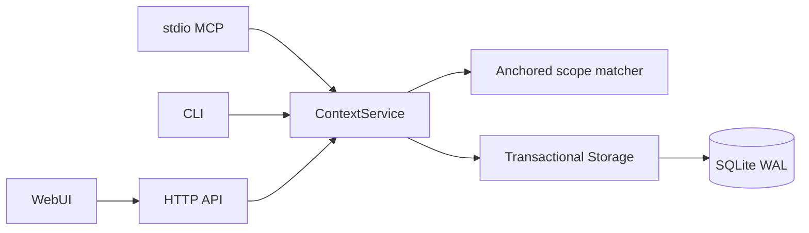

# 0.4 架构与行为契约

## 分层

`service.py` 负责会话绑定、上下文选择、下发凭据、幂等重试和版本反馈。`storage.py` 负责带事务的关系校验、生命周期与版本持久化。`database.py` 为单连接多线程提供整事务互斥，为嵌套工作单元提供 savepoint。多个 MCP/HTTP 进程通过 SQLite 写事务和 busy timeout 协调。

HTTP 的复合操作在整个 handler 上包裹事务。规则内容、快照、审计同时提交；任意阶段失败全部回滚。编辑使用观察到的版本比较，避免后写覆盖前写。

## 关键实体

| 对象 | 作用及约束 |
|---|---|
| Project | 显式仓库根目录；不会自动扫描或注册示例工程 |
| WorktreeInstance | 已注册路径、机器、Git 分支和最后访问时间；身份不能被改绑到其他项目 |
| Task | 独立需求生命周期；task/project 关系写入时验证 |
| AgentSession | 固定 project/worktree/task，保存客户端来源和 debug 标志 |
| Rule / RuleVersion | 规则状态、内容、范围、版本；范围必须是相对路径；版本快照唯一 |
| ContextDelivery / DeliveryRules | 下发请求、实际内容、规则版本和完整/提醒表示 |
| SessionKnowledge | 哪个会话对哪个规则版本明确反馈“已知” |
| RuleEvaluation | 关联 session + delivery + rule version；相同下发只记录一次 |
| Finding / Proposal / Issue | 带来源的观察与提案；未经审核的发现限定在相同任务/会话 |
| AuditEvent | API 不提供修改和删除入口的持久变更记录 |

## 上下文流程

1. 校验会话仍开放、项目与任务一致。
2. 将文件路径归一到固定工作区，拒绝越界和逃逸符号链接。
3. 选取已启用的项目长期规则及当前仍活跃任务的短期规则。
4. 以锚定 Glob 匹配路径，避免 basename fallback 导致跨目录误命中。
5. 查询当前会话对规则当前版本的明确已知记录。
6. 按 P0/P1/P2 合成内容；P0 不因重复或预算被静默省略。
7. 实际 Agent 下发：在同一事务中写入凭据、规则版本集合、审计及命中数。页面预览不执行这些写入。

反馈绑定实际下发版本。规则更新后，旧版本评分留在历史记录，当前版本的评分统计重新开始。0 表示知识已知，不等于规则质量差；它不会全局降低其他会话的上下文。

## 数据库与迁移

`PRAGMA user_version` 记录 schema 版本。迁移使用 SQLite 显式事务，拒绝较新版本数据库，检查实际列名后增补字段，不吞掉任意 SQL 错误。

首次升级保留历史命中数为 `legacy_hit_count`，实际下发计数从可追溯凭据开始。已知的模拟记录标记 `source=demo`，默认查询不展示/注入这些记录。其他旧记录保留并标记 `legacy`。迁移不会删除原规则或历史内容。

同一台机器上的多个进程可共用数据库；不要将 SQLite 数据库放在多机共享网络文件系统上。跨主机部署需要独立的远程工作区注册、身份认证与服务端存储设计，不应把服务器上的目录验证假装成对另一台机器的验证。

## 当前边界

- MCP 自身不提供文件访问拦截；Agent/宿主工具必须主动接入上下文调用。
- 身份字段用于规则隔离与追踪；HTTP 可选 Bearer Token 是实例级认证，不是多用户租户隔离。
- “在线”表示最近 120 秒有客户端访问/心跳，不是操作系统进程存活保证。
- 结构体检只提示范围相同、孤儿任务、低相关性反馈等已知结构现象，不推断自然语言规则是否语义矛盾。
- 不包含自主编码调度器。部署、复测、导出和下发计数都不会被汇报成自动产生的新功能。
- 字符预算是上下文目标，P0 超出目标时会明确标记；生产调用仍需宿主自身的模型 token 限制。
